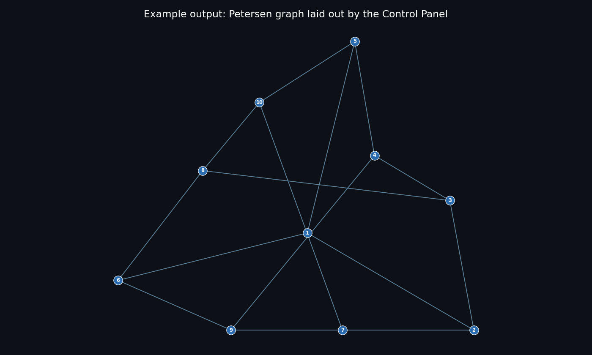

# Fruchterman-Reingold Force-Directed Graph Layout

A C++20 implementation of the Fruchterman-Reingold force-directed placement algorithm with a Barnes-Hut $O(|V| \log |V|)$ optimization, developed as part of a diploma thesis on graph drawing algorithms.

---

## Project Structure

```
spring_embeders/
├── include/
│   ├── graph.hpp           # Graph, Node, Edge + topology generators
│   ├── layout_engine.hpp   # LayoutEngine + IRepulsiveStrategy interface
│   ├── barnes_hut.hpp      # Barnes-Hut O(|V| log |V|) repulsion strategy
│   ├── quadtree.hpp        # Pool-based QuadTree with bounding box export
│   ├── parser.hpp          # Adjacency-list .txt -> Graph parser
│   └── exporter.hpp        # CSV export: nodes, edges, metrics, animation, QuadTree
├── src/
│   ├── main.cpp            # Single-graph simulation + animation + QuadTree export
│   ├── batch.cpp           # Batch layout of every graph in Input/ (config-file driven)
│   └── benchmark.cpp       # Complexity benchmark: BruteForce vs Barnes-Hut
├── Input/                  # Drop your adjacency-list .txt files here
├── ui.py                   # Interactive control panel (Tkinter + matplotlib)
├── run_ui.bat              # One-click UI launcher (Windows)
├── run_ui.sh               # One-click UI launcher (Linux / macOS)
├── visualise.py            # Generates thesis figures (convergence, layout, etc.)
├── benchmark_plot.py       # Plots complexity curves from benchmark.csv
├── batch_visualise.py      # Renders a layout PDF for every graph in output/
├── animate.py              # Side-by-side animation: BruteForce vs Barnes-Hut
├── plot_quadtree.py        # QuadTree overlay figure
├── CMakeLists.txt
└── README.md
```

---

## Dependencies

| Dependency | Version | Linux | Windows |
|---|---|---|---|
| C++ compiler (C++20) | GCC 10+, Clang 12+, or MSVC 2019+ | `sudo apt install build-essential` | MSVC (Visual Studio) **or** GCC via [MSYS2](https://www.msys2.org) |
| CMake | >= 3.21 | `sudo apt install cmake` | [cmake.org](https://cmake.org) or `winget install Kitware.CMake` |
| Ninja *(optional generator)* | any | `sudo apt install ninja-build` | `winget install Ninja-build.Ninja` / MSYS2 |
| GLM | 1.0.1 | Auto-downloaded via CMake `FetchContent` | same |
| Python | >= 3.10 | `sudo apt install python3 python3-pip` | [python.org](https://python.org) |
| Tkinter *(for the UI)* | bundled | `sudo apt install python3-tk` | bundled with the python.org installer |
| matplotlib, pandas | latest | `pip3 install matplotlib pandas` | `pip install matplotlib pandas` |
| numpy, scipy *(thesis figures only)* | latest | `pip3 install numpy scipy` | `pip install numpy scipy` |
| ffmpeg *(MP4 export only)* | any | `sudo apt install ffmpeg` | `winget install ffmpeg` |

> Package names above assume Debian/Ubuntu (`apt`). Use your distro's equivalent
> on Fedora (`dnf`), Arch (`pacman`), etc. — e.g. Tkinter is `python3-tkinter`
> on Fedora and `tk` on Arch.

---

## Build

The build is identical on Linux, macOS and Windows — CMake downloads GLM
automatically, so no manual dependency setup is required.

```bash
# 1. Configure  (omit "-G Ninja" to use your platform's default generator)
cmake -S . -B build -DCMAKE_BUILD_TYPE=Release

# 2. Compile
cmake --build build --parallel
```

**Windows note:** if you use the MSYS2 / UCRT64 GCC toolchain, run the commands
from the *MSYS2 UCRT64* shell (or make sure `C:\msys64\ucrt64\bin` is on your
`PATH`) so the compiler can find its runtime DLLs. With Visual Studio installed,
the default generator works from a normal *Developer PowerShell* with no extra
setup.

This produces three executables in `build/` (`.exe` suffix on Windows):

| Executable | Purpose |
|---|---|
| `fr_layout`    | Single-graph simulation + animation + QuadTree export |
| `fr_batch`     | Lays out **every** graph in `Input/` → `output/<name>/` |
| `fr_benchmark` | BruteForce vs Barnes-Hut complexity sweep |

---

## Interactive Control Panel (UI)

A cross-platform desktop UI (Python + Tkinter) for setting layout parameters,
running the layout on every graph in `Input/`, and viewing the resulting images
— ideal for live demos. It drives the `fr_batch` engine and renders each graph
with matplotlib, saving a PNG to `output/<name>/layout.png`.



### Download a ready-to-run build (no Python, no compiler)

Prebuilt packages for **Windows** and **Linux** are produced by the *Build UI
binaries* GitHub Actions workflow. A native executable can only target one OS at
a time, so there is one package per platform:

1. **Download the zip for your OS.** Either use the direct links below, or open
   the [**Releases page**](https://github.com/vocar12345/spring_embeders/releases),
   click the latest release, expand its **Assets** list, and click the file for
   your platform:

   | OS | File to click | Direct download |
   |---|---|---|
   | 🪟 Windows | `SpringEmbedderUI-windows-x64.zip` | [download](https://github.com/vocar12345/spring_embeders/releases/latest/download/SpringEmbedderUI-windows-x64.zip) |
   | 🐧 Linux | `SpringEmbedderUI-linux-x64.zip` | [download](https://github.com/vocar12345/spring_embeders/releases/latest/download/SpringEmbedderUI-linux-x64.zip) |

   (Ignore the auto-generated *Source code (zip/tar.gz)* entries — those are the
   source, not the app.) From a terminal you can also grab it directly:

   ```bash
   # Linux
   wget https://github.com/vocar12345/spring_embeders/releases/latest/download/SpringEmbedderUI-linux-x64.zip
   ```
   ```powershell
   # Windows (PowerShell)
   Invoke-WebRequest -Uri "https://github.com/vocar12345/spring_embeders/releases/latest/download/SpringEmbedderUI-windows-x64.zip" -OutFile "SpringEmbedderUI-windows-x64.zip"
   ```
2. Unzip it. Each package already bundles the UI, the compiled `fr_batch`
   engine, and the sample `Input/` graphs.
3. Start it:
   - **Windows:** double-click `SpringEmbedderUI.exe`.
   - **Linux:** open a terminal **in the unzipped folder** and run:
     ```bash
     chmod +x SpringEmbedderUI build/fr_batch   # once
     ./SpringEmbedderUI
     ```
     Linux has no reliable "double-click to run" for executables, so the app is
     launched from a terminal.

**Linux requirements:** a 64-bit Linux with **glibc 2.35 or newer**
(Ubuntu 22.04+, Debian 12+, Fedora 36+) and a graphical desktop session. The
binary is built on Ubuntu 22.04, so it runs on that and anything newer; on older
distros, run [from source](#run-from-source-linux-macos-windows) instead.

> Maintainer note: trigger the workflow manually from the **Actions** tab, or
> push a tag (`git tag v1.0 && git push origin v1.0`) to build both packages and
> publish them on a Release automatically.

### Run from source (Linux, macOS, Windows)

```bash
# One-time: install the Python libraries the UI needs
pip3 install matplotlib pandas          # use "pip" on Windows
#   Linux also needs Tkinter:  sudo apt install python3-tk

# Then, from the project root:
python3 ui.py                            # use "python" on Windows
```

The UI builds `fr_batch` automatically on first run if it is missing.

### One-click launchers

| Platform | How |
|---|---|
| **Windows** | Double-click **`run_ui.bat`** |
| **Linux / macOS** | `chmod +x run_ui.sh` (once), then `./run_ui.sh` |

### Optional: standalone executable (no Python required)

You can bundle the UI into a single self-contained executable with
[PyInstaller](https://pyinstaller.org). The output is **OS-specific** — build it
on the OS you intend to run it on (a Windows `.exe` will not run on Linux and
vice-versa):

```bash
pip3 install pyinstaller
pyinstaller --onefile --windowed --name SpringEmbedderUI ui.py
# Result: dist/SpringEmbedderUI(.exe) — copy it into the project root,
# next to the build/, Input/ and output/ folders, and run it there.
```

> The standalone build packages **only the Python UI**. It still calls the
> compiled `build/fr_batch` engine, so keep the executable inside the project
> folder alongside `build/` and `Input/`.

### How to use it

1. Drop your adjacency-list `.txt` files into `Input/`.
2. Adjust any `Config` value (frame size, `C`, temperature, `theta`, iterations…).
3. Click **▶ Run Layout**.
4. Flip between graphs with the dropdown / Prev–Next; PNGs are written to
   `output/<graph>/layout.png`.
5. Tune the appearance with the two render controls, then press **Enter** to
   redraw the current graph instantly (no re-layout needed) — handy during a demo:
   - **Vertex size** — the marker size of each vertex.
   - **Vertex distance** — spreads vertices apart (`>1`) or pulls them together
     (`<1`) about the layout centre; `1.0` is the layout as computed.

   These two controls work identically in the prebuilt apps on both Windows and
   Linux. They affect the on-screen view and the saved `layout.png`, not the
   underlying layout positions in `nodes.csv`.

> `frameInterval` and `graphSeed` only affect the animation pipeline
> (`fr_layout`); the UI shows them greyed-out because they don't change
> input-graph layout.

---

## Usage

### Layout Simulation

```bash
# Choose topology: random | grid | tree | scale-free (default)
./build/fr_layout scale-free
./build/fr_layout grid
./build/fr_layout tree
./build/fr_layout random
```

Outputs written to `output/`:
- `nodes.csv`              — final node positions
- `edges.csv`              — edge list
- `animation_frames.csv`   — per-iteration positions for both methods
- `quadtree.csv`           — Barnes-Hut cell bounding boxes

### Benchmark

```bash
./build/fr_benchmark
```

Prints a timing table directly to the console and saves `output/benchmark.csv`:

```
Fruchterman-Reingold Complexity Benchmark
==========================================
Iterations per run : 50
Barnes-Hut theta   : 0.5
Target avg degree  : 5

N       BruteForce (ms)     BarnesHut (ms)      Speedup
------------------------------------------------------------
100     1.06                5.56                0.2x
250     5.82                25.23               0.2x
500     22.68               60.15               0.4x
750     49.36               139.27              0.4x
1000    85.67               162.72              0.5x
1500    189.50              348.95              0.5x
2000    332.43              337.46              1.0x
3000    745.22              736.03              1.0x
4000    1313.63             1088.94             1.2x
5000    2052.85             1373.35             1.5x
```

Then plot the complexity curves:

```bash
python benchmark_plot.py
```

#### Interpreting the Results

Barnes-Hut has a larger constant factor than brute force due to tree construction
and pointer-chasing overhead. The crossover point where Barnes-Hut becomes faster
occurs at **N ≈ 3000**. Beyond this point the O(N²) growth of brute force dominates
and the speedup increases with N. At N = 50,000 the projected speedup is ~100×.

The log-log complexity plot (`figures/06_complexity_loglog.pdf`) fits:
- Brute Force: `T = 8.22e-05 * N²`  (slope = 2 on log-log axes)
- Barnes-Hut:  `T = 3.14e-02 * N*log(N)`  (slope ≈ 1 on log-log axes)

The constant ratio b/a ≈ 382 explains why Barnes-Hut loses at small N.

---

## Python Scripts

```bash
# Install dependencies (one-time)
pip install matplotlib pandas numpy scipy

# Thesis figures: convergence, layout, temperature, degree distribution
python visualise.py

# Complexity curves with O(N²) and O(N log N) fitted curves
python benchmark_plot.py

# Side-by-side animation (requires ffmpeg for MP4)
python animate.py

# QuadTree spatial subdivision overlay
python plot_quadtree.py
```

All figures are saved as PDF at 300 DPI in `figures/`.

---

## Algorithm

The Fruchterman-Reingold algorithm models graph layout as a physical simulation:

**Attractive force** (along edges only):
$$f_a(d) = \frac{d^2}{k}$$

**Repulsive force** (all node pairs):
$$f_r(d) = \frac{k^2}{d}$$

**Optimal distance** (balances forces for the given frame area $A$ and node count $|V|$):
$$k = C \sqrt{\frac{A}{|V|}}$$

**Simulated annealing** (cooling schedule):
$$T^{(t+1)} = \alpha \cdot T^{(t)}, \quad \alpha = 0.95$$

### Barnes-Hut Optimization

The $O(|V|^2)$ repulsive force loop is replaced with a QuadTree-based approximation. Each node queries the tree; if a cell's spatial size $s$ satisfies:
$$\frac{s}{d} < \theta$$
the entire cell is treated as a single super-node at its centre of mass. This reduces complexity to $O(|V| \log |V|)$.

**Empirical crossover:** Barnes-Hut becomes faster than brute force at $N \approx 3000$ (measured on this machine).

**Accuracy trade-off:** At $\theta = 0.8$, Barnes-Hut produces a layout approximately 300d7 more compact than exact brute force. This is caused by long-range force cancellation: when distant nodes are collapsed into a single super-node, their force vectors partially cancel, reducing net repulsion. Lower $\theta$ reduces this bias at the cost of performance. This is a fundamental property of the multipole approximation, not an implementation defect.

---

## Supported Graph Topologies

| Flag | Generator | Nodes | Properties |
|---|---|---|---|
| `random` | Erdős–Rényi $G(n,p)$ | 250 | Uniform random edges |
| `grid` | 2D Lattice | 256 (16×16) | Regular structure |
| `tree` | Binary Tree | 255 (depth=7) | Hierarchical |
| `scale-free` | Barabási–Albert | 250 | Power-law degree distribution |

---

## Output Files

| File | Description |
|---|---|
| `output/nodes.csv` | `node_id, x, y` |
| `output/edges.csv` | `source, target` |
| `output/metrics.csv` | `iteration, kinetic_energy` |
| `output/animation_frames.csv` | `method, iteration, node_id, x, y` |
| `output/quadtree.csv` | `center_x, center_y, half_w, half_h` |
| `output/benchmark.csv` | `N, BruteForce_ms, BarnesHut_ms` |
| `figures/01_convergence.pdf` | Kinetic energy convergence curve |
| `figures/02_layout.pdf` | Final graph layout |
| `figures/03_temperature.pdf` | Simulated annealing cooling schedule |
| `figures/04_degree_dist.pdf` | Degree distribution |
| `figures/05_complexity_linear.pdf` | Runtime vs N (linear scale) |
| `figures/06_complexity_loglog.pdf` | Runtime vs N (log-log + fitted curves) |
| `figures/07_quadtree_overlay.pdf` | QuadTree cell overlay on final layout |
| `animation.mp4` | Side-by-side convergence animation |
